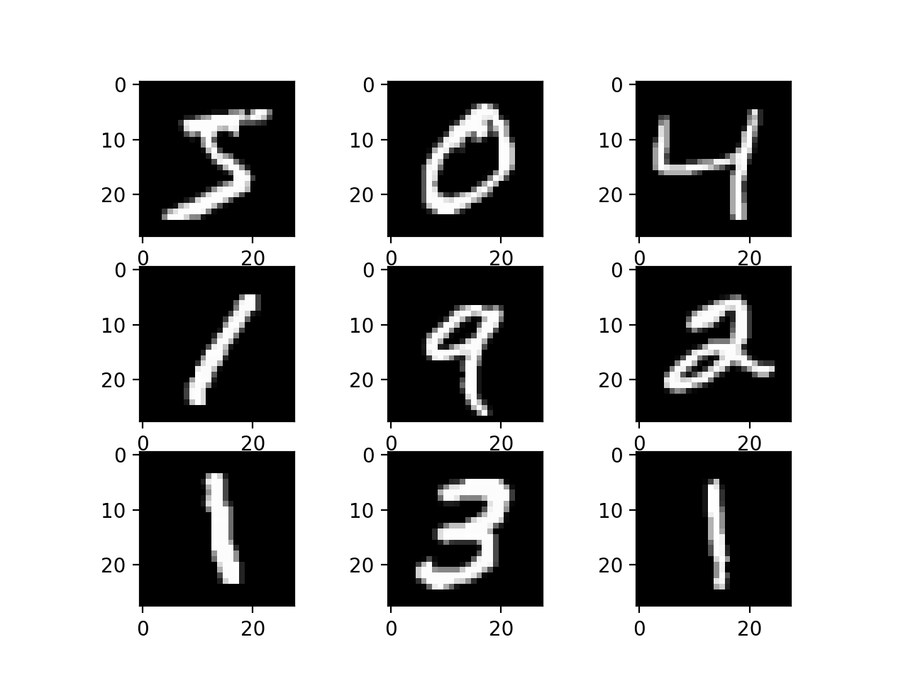

# NN from scratch

Objective: implement training and evaluation of a neural network architecture with varying number of layers and hidden units. 

## MNIST dataset

The MNIST database of handwritten digits has a training set of 60,000 examples, and a test set of 10,000 examples. Further more 20 % of training examples were used for development set to select apropiate model from many architectures. The MNIST database is included in the repository.

## Architecture

The available hyperparameters are: number of hidden layers, number of hidden units in each layer, learning rate, batch size, number of epochs, dropout rate for regulation and training/development split ratio. Satisfactory results were obtained with hyperparameters:

| Hyperparameter      | Value         | 
| --------------------|:-------------:| 
| architecture        | [300, 600]    |
| learning rate       | 0.0002        |
| batch_size          | 100           |
| epochs              | 40            | 
| drop_size           | [60, 120]     | 
| dev_perc            | 0.2           | 

## Results

As can be seen from the below Figure after 15 epochs development error doesn't change significanty. The gap between development error and training error after 10 epochs might suggest that the model is underfitting the data. However, when the neural network architecture was modified to be more complex the model was overfitting the training data, resulting in lower training loss function and higher development loss function. Therefore, this architecture was chosen as the final one.  

Evaluation was done by computing accuracy, precision, recall and F1-score on the testset for a multiclass classification problem:

| Measure         | Value         | 
| ----------------|:-------------:| 
| Accuracy        | 92.520%       |
| Precision       | 92.588%       |
| Recall          | 92.380%       |
| F1              | 92.484%       |

and the confusion matrix of predicted numbers and labelled testset:

